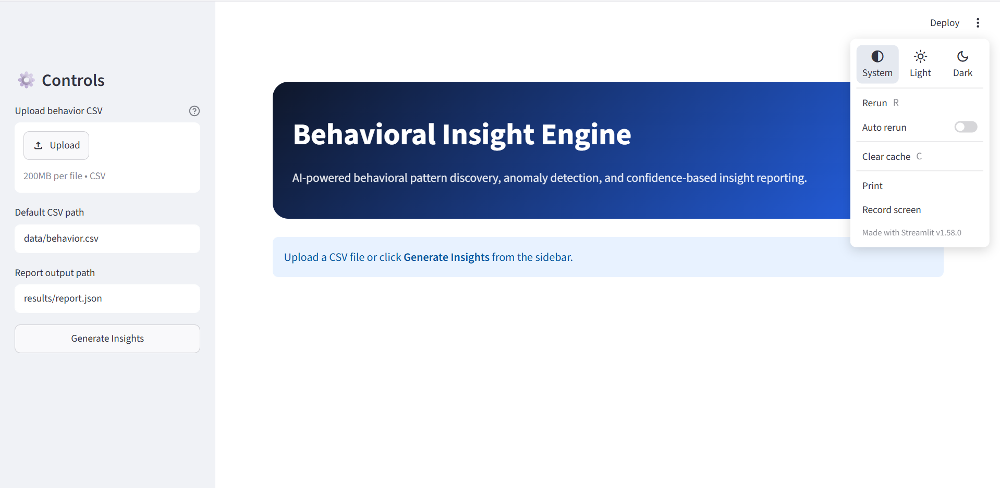
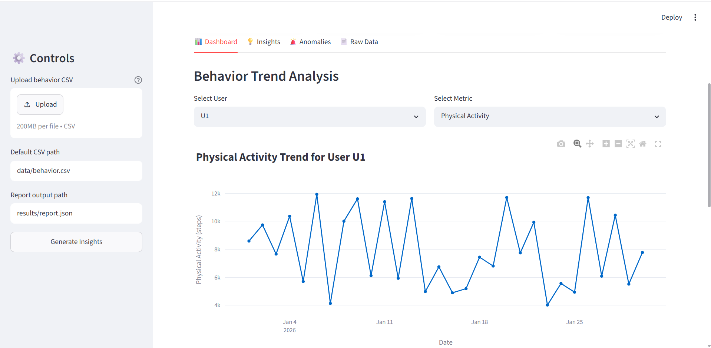
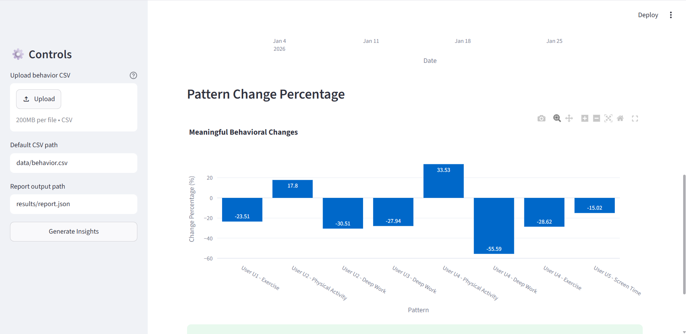
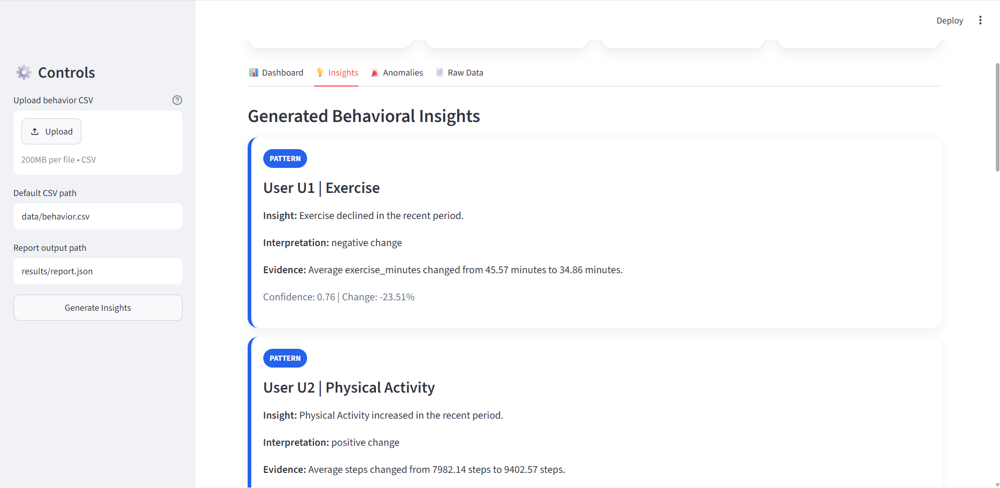
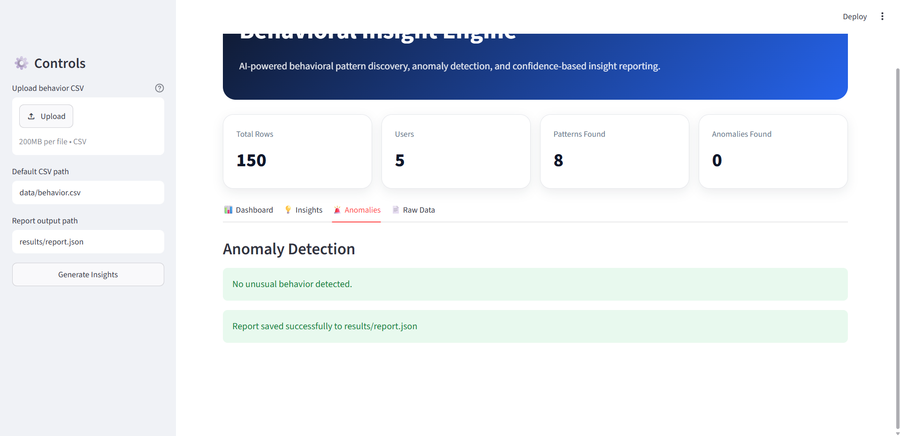
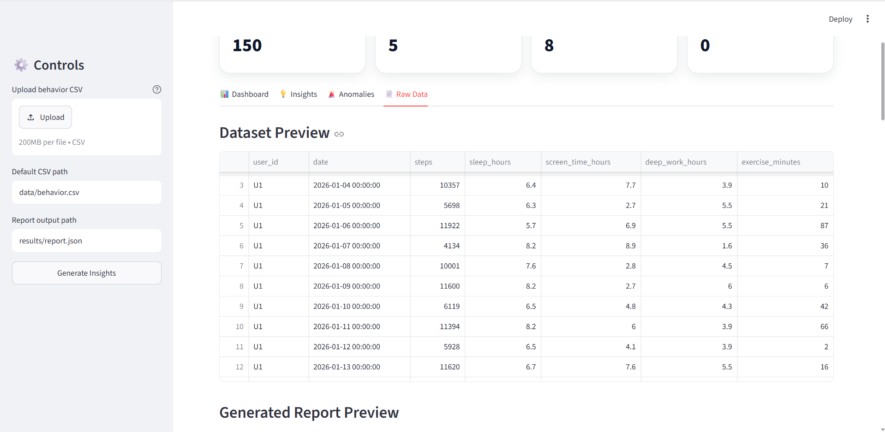
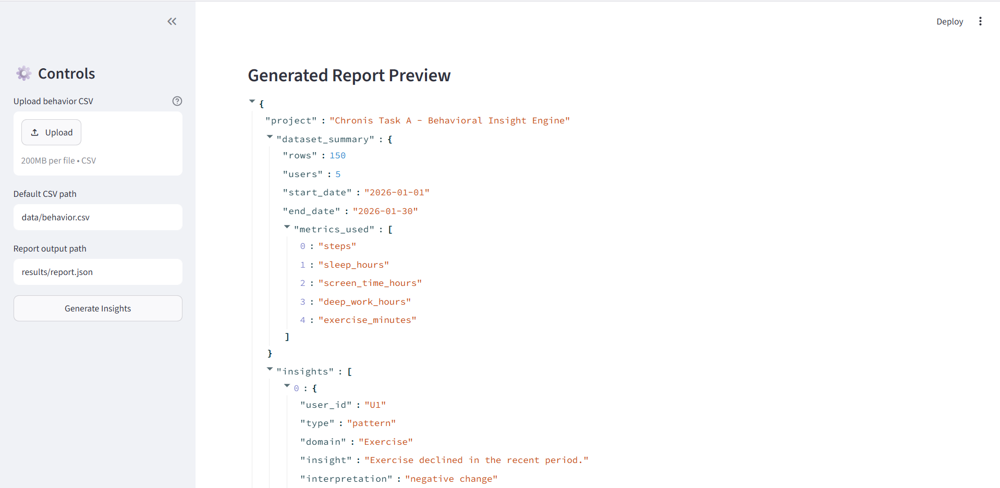
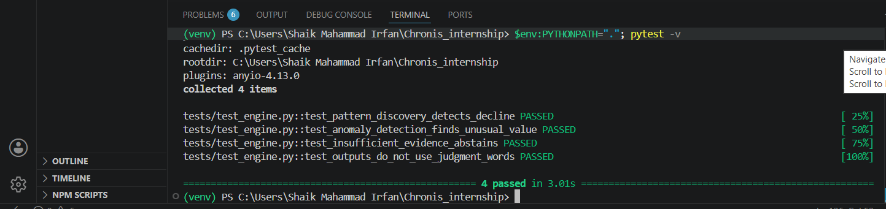

# Chronis Behavioral Insight Engine

A Python-based behavioral analytics system for discovering meaningful patterns, detecting unusual changes, and generating evidence-backed insights from daily behavioral data.

## Project Structure

```text
├── data/                     - Input behavioral dataset
│   └── behavior.csv
├── src/                      - Core insight engine code
│   └── main.py
├── tests/                    - Pytest test cases
│   └── test_engine.py
├── results/                  - Generated insight reports
│   └── report.json
├── app.py                    - Streamlit dashboard frontend
├── decisions.md              - Methodology, assumptions, and failure modes
├── requirements.txt          - Python dependencies
├── README.md                 - Project documentation
└── .gitignore
```

## Setup

### Create Virtual Environment

```bash
python -m venv venv
```

Activate the environment.

For Windows:

```bash
venv\Scripts\activate
```

For Mac/Linux:

```bash
source venv/bin/activate
```

### Install Dependencies

```bash
pip install -r requirements.txt
```

## Run Insight Engine

```bash
python src/main.py
```

This reads the dataset from:

```text
data/behavior.csv
```

and generates the output report at:

```text
results/report.json
```

## Run Dashboard

```bash
streamlit run app.py
```

The dashboard provides a reviewer-friendly interface for exploring trends, insights, confidence scores, evidence, anomalies, and abstention cases.

## Demo Video

A short demo video is available here:

[Watch Demo Video](https://drive.google.com/file/d/1UzVWWTeo7-TSsyU1FgCv184kPE5lJSqm/view?usp=sharing)

The demo video shows:

* Running the Streamlit dashboard
* Uploading or selecting the behavioral CSV file
* Generating insights
* Viewing behavioral trends
* Checking pattern insights
* Checking anomaly detection results
* Viewing abstention cases
* Inspecting the generated JSON report

## Screenshots

### Entry Page



### Dashboard Page 1



### Dashboard Page 2



### User Insights



### Anomaly Detection



### Raw Data View 1



### Raw Data View 2



### Test Results




## Run Tests

For Windows PowerShell:

```bash
$env:PYTHONPATH="."; pytest -v
```

For Mac/Linux:

```bash
PYTHONPATH=. pytest -v
```

## Features

- Discovers behavioral patterns using recent 7-day vs previous 7-day comparison
- Detects unusual behavioral changes using z-score based anomaly detection
- Generates human-readable insights
- Provides confidence scores for each generated insight
- Shows supporting evidence for every claim
- Abstains when evidence is insufficient
- Avoids judgmental or character-based language
- Includes pytest test suite for core logic
- Includes Streamlit dashboard for better project presentation

## Behavioral Metrics Used

- Steps
- Sleep hours
- Screen time hours
- Deep work hours
- Exercise minutes

## Output Example

```json
{
  "user_id": "U1",
  "type": "pattern",
  "domain": "Physical Activity",
  "insight": "Physical Activity declined in the recent period.",
  "confidence": 0.84,
  "evidence": "Average steps changed from 8100.00 steps to 5400.00 steps."
}
```

## Tech Stack

- **Language**: Python
- **Data Processing**: Pandas, NumPy
- **Testing**: Pytest
- **Frontend Dashboard**: Streamlit
- **Visualization**: Plotly
- **Output Format**: JSON

## Methodology

The system compares recent behavioral activity with previous behavioral activity to identify meaningful changes. It uses clear statistical rules instead of complex models so that every insight remains explainable and easy to verify.

For anomaly detection, the system compares each value with the user's historical average and standard deviation. If the value is unusually far from normal behavior, it is flagged as an anomaly.

## Evidence Sufficiency

The system does not force insights when data is weak.

It abstains when:

- There are too few recent records
- There are too few previous records
- There is not enough history for anomaly detection
- The observed change is too small to be meaningful

## Project Goal

The goal of this project is to convert raw daily behavioral observations into useful, explainable, and evidence-backed insights while avoiding unsupported or judgmental claims.
